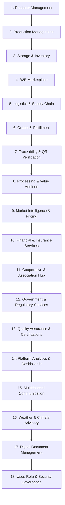

# AgriHub PH — Full Platform Architectural Roadmap & Implementation Blueprint

AgriHub PH is an offline-first agricultural, fisheries, and food supply chain platform designed to connect producers, cooperatives, buyers, processors, logistics providers, government agencies, financial institutions, and platform administrators.

---

## 1. Platform Value Chain Domains (18 Core Modules)

---

## 2. Comprehensive Role Hierarchy & Access Matrix

### A. Producer Roles
- **Farmer**: Crops, vegetables, fruits, highland produce, grains.
- **Fisher**: Capture fisheries, municipal waters, commercial fishing, vessel operators.
- **Aquaculture Producer**: Fishponds, cages, pens, hatcheries, seaweed farming.
- **Livestock Producer**: Cattle, swine, goat, sheep, animal husbandry.
- **Poultry Producer**: Broiler, layer, duck, gamefowl production.

### B. Producer Organization Roles
- **Cooperative Staff / Manager / Admin**: Bulk lot consolidation, member payouts, storage allocation.
- **Association Officer / Staff**: Member registration, collective input procurement, government liaison.
- **Collection Center Operator**: Aggregation hub intake, quality grading, weighmaster.

### C. Commercial Roles
- **B2B Buyer**: Supermarkets, restaurant chains, institutional buyers, food service.
- **Trader / Wholesaler**: Wholesale market trading, spot buying, forward contracts.
- **Retailer / Grocery Operator**: End-consumer retail listings, shelf distribution.
- **Processor / Manufacturer**: Food processing, canning, drying, freezing, feed mill operation.
- **Packaging Provider**: Crates, sacks, vacuum packs, temperature-controlled containers.
- **Cold-Storage Facility Operator**: Temperature-monitored bulk warehousing, lot leasing.

### D. Logistics Roles
- **Transport Operator / Fleet Manager**: Trucking, reefer vans, inter-island cargo shipping, dispatch.
- **Driver / Courier**: Route execution, temperature logging, proof of delivery.

### E. Government & Regulatory Roles
- **LGU Agriculture Officer**: Municipal harvest reporting, farmer assistance, local subsidies.
- **Regional Agriculture / BFAR Officer**: Coastal fisheries management, crop production monitoring, disease quarantine.
- **Inspector / Auditor**: GAP/GAqP compliance, sanitary/phytosanitary inspections, safety checks.
- **Government Administrator**: National policy reporting, food security tracking.

### F. Financial & Insurance Roles
- **Financial Institution Officer / Loan Officer**: Agri-credit scoring, production loan approval.
- **Crop / Aquaculture Insurance Provider**: PCIC integration, climate damage assessment, claim processing.
- **Subsidy Program Partner**: Voucher disbursement, input subsidy distribution.

### G. Platform Roles
- **Platform Support**: Customer support, ticket resolution, user assistance.
- **Platform Auditor**: Security audit, dispute resolution, compliance enforcement.
- **Platform / Super Administrator**: RBAC configuration, system metrics, organization verification.

---

## 3. Four-Phase Rollout Plan

### Phase A — Shared Platform Foundation (THIS PHASE)
- [x] Expanded user, role, permission, and multi-tenant organization models.
- [x] Shared producer model (`ProducerProfile`) for agriculture & fisheries.
- [x] Shared production site model (`ProductionSiteEntity` for farms, ponds, cages, vessels, warehouses).
- [x] Shared commodity catalog (`CommodityItemEntity` covering crops, fish, livestock, processed, inputs).
- [x] Role-specific application shells (`/producer`, `/coop`, `/buyer`, `/processor`, `/logistics`, `/gov`, `/finance`, `/admin`).
- [x] Shared document, certification, audit logging, and notification models.
- [x] Expanded Dexie IndexedDB v6 schema & sync engine.

### Phase B — Commercial & Value Addition Workflows
- B2B Wholesale Marketplace & Forward Pre-Sell Contracts.
- Food Processing & Packaging Production Lines.
- Quality Assurance & Inspection Workflows (GAP, GAqP, HACCP).
- Digital Procurement & PayMongo Escrow Settlement.

### Phase C — Logistics, Cold Chain & Traceability
- Cold-Chain Storage & Transport Dispatching.
- Fleet Management & Temperature Data Logging.
- Batch Traceability & Public QR Verification Code Generation.
- Multichannel SMS & Advisory Notifications.

### Phase D — Government, Financial Services & Ecosystem Integration
- LGU / BFAR Government Reporting & Subsidy Vouchers.
- Production Credit Scoring & Agricultural Insurance Claims.
- Platform Audit & System Analytics Dashboards.
